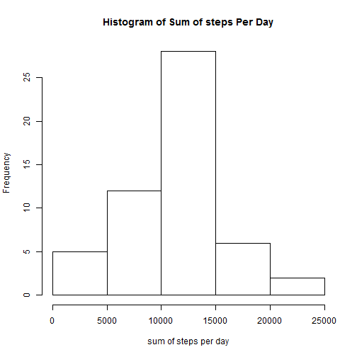
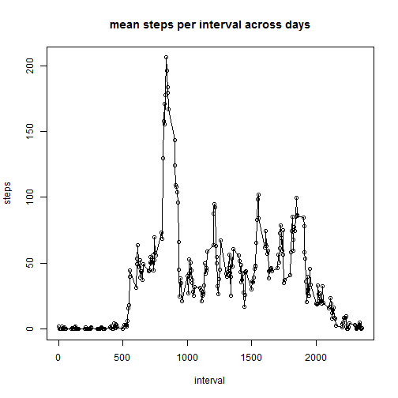
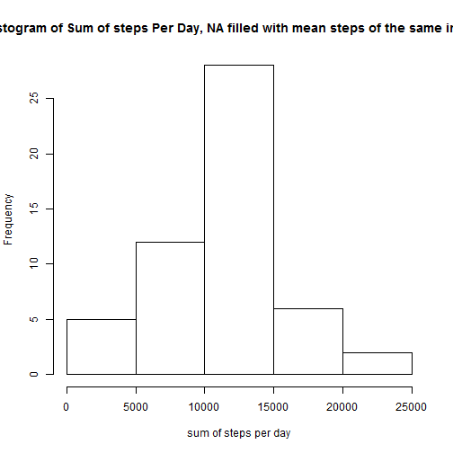
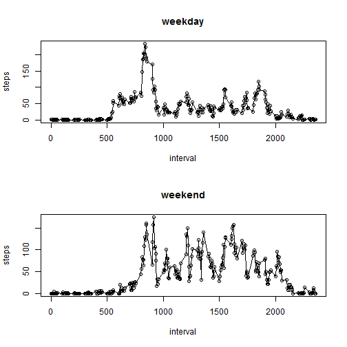

Reproducible Research Assignment I
========================================================

This is the assignment I of the "Reproducible Research" class by Roger Peng from John Hopkins University. The assignment deals with a dataset of human activity level recorded by a mobile device. We need to do some simple analysis of the data and answer several related questions.

# Part 1. Loading and preprocessing the data 
here's code. Note that I've unzipped the data into a .csv file


```r
df.activity <- read.csv('activity.csv')
df.activity <- transform(df.activity,date = factor(date))
```

# Part 2. Calculate mean & median total number of steps per day, and plot a histogram of total number of steps per day


```r
sum.steps <- aggregate(steps ~ date, data = df.activity, FUN = sum)
hist(sum.steps$steps, xlab = 'sum of steps per day', main = 'Histogram of Sum of steps Per Day')
```

 

```r
summary(sum.steps$steps) #mean and median
```

```
##    Min. 1st Qu.  Median    Mean 3rd Qu.    Max. 
##      41    8840   10800   10800   13300   21200
```

# Part 3. Average daily activity pattern
Make a time series plot (i.e. type = "l") of the 5-minute interval (x-axis) and the average number of steps taken, averaged across all days (y-axis)


```r
mean.steps <- aggregate(steps ~ interval, data = df.activity, FUN = mean)
plot(mean.steps, main = "mean steps per interval across days")
lines(mean.steps)
```

 
Answer: which 5-minute interval, on average across all the days in the dataset, contains the maximum number of step? 

```r
 mean.steps[which.max(mean.steps$steps),1]
```

```
## [1] 835
```

# Part 4. Imputing missing values

Calculate and report the total number of missing values in the dataset (i.e. the total number of rows with NAs)

```r
nrow(df.activity) - sum(complete.cases(df.activity))
```

```
## [1] 2304
```

Devise a strategy for filling in all of the missing values in the dataset. The strategy does not need to be sophisticated. For example, you could use the mean/median for that day, or the mean for that 5-minute interval, etc.

```r
na_interval <- df.activity[which(is.na(df.activity)),3] #interval number of the missing value
na_filling_value <- mean.steps[mean.steps$interval == na_interval,2] #average steps of that interval across days
```

Create a new dataset that is equal to the original dataset but with the missing data filled in.

```r
df.filling <- df.activity
df.filling[is.na(df.filling) <- na_filling_value]
```

```
## Error: missing values are not allowed in subscripted assignments of data
## frames
```

Make a histogram of the total number of steps taken each day and Calculate and report the mean and median total number of steps taken per day. Do these values differ from the estimates from the first part of the assignment? What is the impact of imputing missing data on the estimates of the total daily number of steps?
If we compare these numbers from the no-filled calculations, we would find that the values do differ a lit bit. For example, here I filled the missing values with the mean of the steps from the same interval, what this will do is that, it won't affect the mean (since the filled-in value is also mean), but the median increased from 10760 to 10770. Adding some missing data would definitely increase the total daily number of steps because originally that missing value is not added to the sum.

```r
sum.fillingsteps <- aggregate(steps ~ date, data = df.filling, FUN = sum)
hist(sum.fillingsteps$steps, xlab = 'sum of steps per day', main = 'Histogram of Sum of steps Per Day, NA filled with mean steps of the same interval')
```

 

```r
summary(sum.fillingsteps$steps) #mean and median
```

```
##    Min. 1st Qu.  Median    Mean 3rd Qu.    Max. 
##      41    8840   10800   10800   13300   21200
```

Which 5-minute interval, on average across all the days in the dataset, contains the maximum number of steps?

```r
mean.fillingsteps <- aggregate(steps ~ interval, data = df.filling, FUN = mean)
mean.fillingsteps[which.max(mean.fillingsteps$steps),1]
```

```
## [1] 835
```

# Part 5. Difference in activity pattern between weekedays and weekends

Create a new factor variable in the dataset with two levels - "weekday" and "weekend" indicating whether a given date is a weekday or weekend day.

```r
df.filling$weekday <- weekdays(as.Date(df.filling$date, '%Y-%m-%d'))
# this is really stupid but I'm running out of time (and brain) :(
df.filling[df.filling$weekday == "Saturday",4] <-'weekend'
df.filling[df.filling$weekday == "Sunday",4] <-'weekend'
df.filling[df.filling$weekday == "Monday",4] <-'weekday'
df.filling[df.filling$weekday == "Tuesday",4] <-'weekday'
df.filling[df.filling$weekday == "Wednesday",4] <-'weekday'
df.filling[df.filling$weekday == "Thursday",4] <-'weekday'
df.filling[df.filling$weekday == "Friday",4] <-'weekday'
#stupid 
```
Make a panel plot containing a time series plot (i.e. type = "l") of the 5-minute interval (x-axis) and the average number of steps taken, averaged across all weekday days or weekend days (y-axis).

```r
df.filling$weekday <- factor(df.filling$weekday)
mean.fillingsteps <- aggregate(steps ~ interval+weekday, data = df.filling, FUN = mean)
mean.weekday = mean.fillingsteps[mean.fillingsteps$weekday == 'weekday',]
mean.weekend = mean.fillingsteps[mean.fillingsteps$weekday == 'weekend',]
par(mfrow = c(2,1))
plot(steps ~ interval, data = mean.weekday, main = 'weekday')
lines(steps~interval, data = mean.weekday)

plot(steps~interval, data = mean.weekend, main = 'weekend')
lines(steps~interval,data = mean.weekend)
```

 
